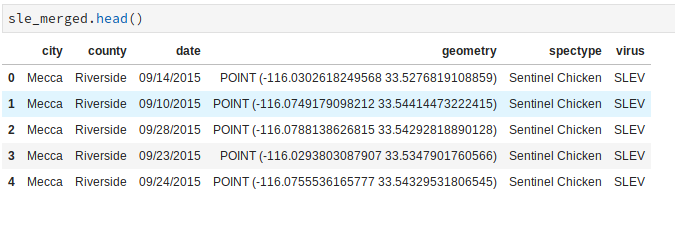
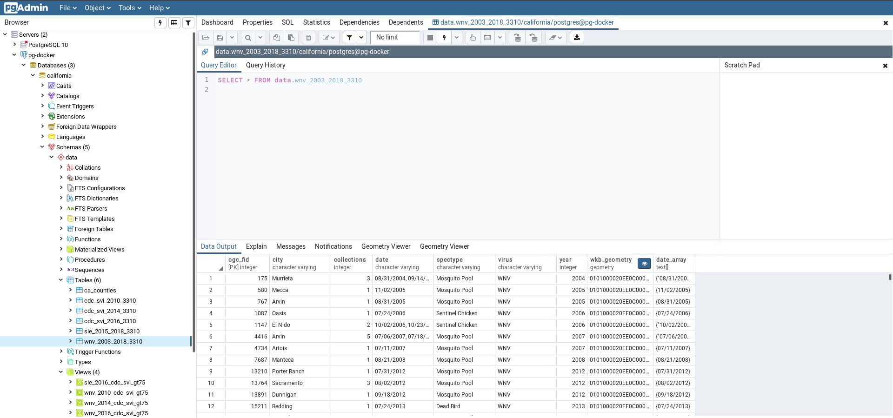
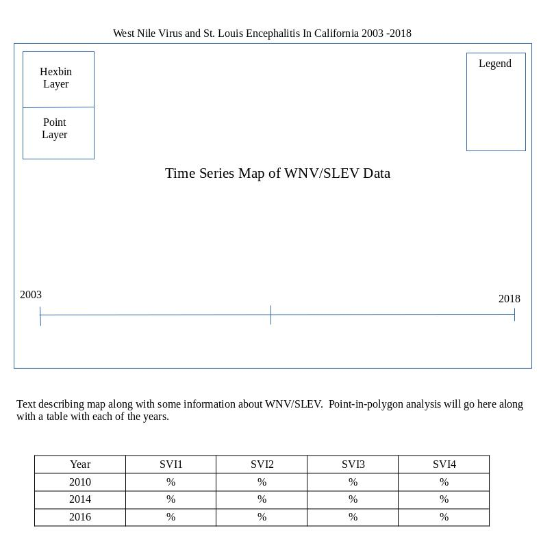
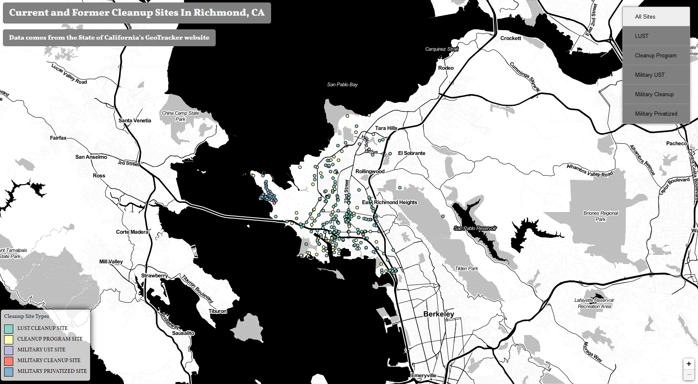

# [West Nile Virus](https://www.cdc.gov/westnile/index.html) and [St. Louis Encephalitis](https://www.cdc.gov/sle/) In California's Vulnerable Communities

**I. Introduction**

"West Nile virus (WNV) and St. Louis encephalitis virus (SLEV) are arthropod-borne flaviviruses" (Oyer, Beckham, Tyler 433, '[Handbook of Clinical Neurology: Chapter 20 - West Nile and St. Louis encephalitis viruses](https://www.sciencedirect.com/science/article/pii/B9780444534880000201)', 2014) that have a presence in Californa. WNV is a pretty well known commodity at this point and typically catches local news headlines when the virus has been found in a deceased crow, but there has been a reemergence in California of SLEV. This reemergence started around 2015 after a long period without detection. Both viruses can be found throughout California and are typically spread between mosquitoes and birds. Infection in humans is a byproduct of living in close proximtiy to both vectors for WNV and SLEV. Most infections of WNV and SLEV in humans are asymptomatic and when there is an illness due to contraction the result is mostly flu-like. However in a small number of cases the illness can be quite severe and even cause death.

In the web map linked in the data sources section below we can see where WNV/SLEV outbreaks may be occurring and with this map I hope to make an attempt at showing the density of these WNV/SLEV outbreaks.  I would also like to possbily identify where these outbreaks are occurring and who may be most effected by them using data from the CDC.  The CDC has created data layers using 15 census variables to identify census tracts that may be vulnerable to "stresses on human health, such as natural or human-caused disasters, or disease outbreaks" ([CDC Social Vulnerability Index (SVI)](https://svi.cdc.gov/data-and-tools-download.html)). These CDC provided data layers will be used in conjuction with surveillance data for WNV and SLEV in California to provide finer grain detail as to what areas may be affected by these viruses instead of the more general detail we see with a point feaure displayed on a map with no other layers.

**II. Methodolgy**

   *A. Data*
    
   [CDC Social Vulnerability Index (SVI)](https://svi.cdc.gov/data-and-tools-download.html)
   The CDC describes their Social Vulnerability index as a way to measure the ability of a community to withstand "external stresses on human health, such as natural or human-caused disasters, or disease outbreaks".  The Social Vulnerability Index has adopted "15 U.S. census variables at the tract level" to aid in the identification of communities that would potentially need help in being able to prepare for, or recover from, a disaster which could dramtically afffect its public health and well-being.

   [California Surveillance Gateway Maps](https://legacy-maps.calsurv.org/)

   
   
   Data was cleaned and manipulated using [Pandas](https://pandas.pydata.org/), [Geopandas](http://geopandas.org/), and [Jupyter Notebooks](https://jupyter.org/).  Point-in-polygon analysis was performed on data using [PostgreSQL](https://www.postgresql.org/)/[PostGIS](https://postgis.net/).  The anticpated format for the finalized and cleaned data will be GeoJSON.  
  
  *Example of cleaned up data:*  
  

  *PostgreSQL/PostGIS Database In Docker Container*
  

   *B. Medium For Delivery*

   The final deliverable will be a web-browser based application making use of HTML, CSS, JavaScript, and [MapboxGL](https://docs.mapbox.com/mapbox-gl-js/api/).  Point-in-polygon analyis is being done on the back-end with [PostgreSQL](https://www.postgresql.org/)/[PostGIS](https://postgis.net/).  
   
   *C. Application Layout*
    
   
   
   *D. Thematic Representation*
   
   WNV and SLEV surveillance data in the time series map will be represented as points with separate colors for each virus.  California counties will be represented with polygons so as to give a better idea where positive detections have been occurring within California.  CDC identified vulnerable census tracts and virus data for 2010, 2014, and 2016 will be represented table form, as well as have a write-up about the analysis.  WNV data goes back to 2003 and each of these years will be represented in the table, but SLEV data only goes back to 2015 and will be talked about within the write-up.     
   
   
   *E. User Interaction*

   1. Time series map with slider to display WNV & SLE Data.
   
      Users will be able to move a slider to view the positive detections of WNV and SLEV throughout 2003 -2018 in California.  The individual point data will also be able to be interacted with by giving the user the option to hover on a point to view more in depth information.  County polygons will also highlight to show detections within more clearly.  The data that will be available for a given point will be the city, county, collection dates, specimen type (Mosquito or Sentinel Chicken), virus.  
    

   *F. Aesthetics and design considerations*

   I've tended to like darker themes in many of my projects since there tends to be more pop with the data displayed.  I've also used the [Vollkhorn](https://fonts.google.com/specimen/Vollkorn) font in a lot (or probably most) of my mapping projects and am leaning that way for a font but could be persuaded to venuture out.  Below is an example of a previous [project](https://bazini627.github.io/richGeoTracker) where a similar theme ([Stamen Toner](http://maps.stamen.com/toner/#12/37.7706/-122.3782)) may work well: 

       
  
   *G. Conclusion*

   There have been [efforts](https://verily.com/projects/interventions/debug/) in California to reduce the population of the invasive *Aedes aegypti* mosquitoes, which can transmit Dengue, Zika, Chikungunya and Yellow Fever, by releasing sterile male mosquitoes.  WNV and SLEV are transmitted by the native *Culex* mosquitoes in California.  One of the easiest preventative measures that can be taken is the removal of any standing water that would allow the *Culex* mosquitoes to breed easily in densely populated areas. This mapping project could possibly help identify census tracts where residents are especially vulnerable and potentially aid in education campaigns in these areas to help reduce the *Culex* populations. 