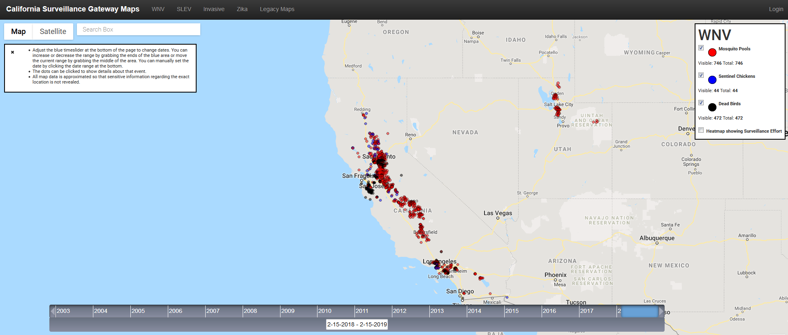

# West Nile Virus and St. Louis Encephalitis In California's Vulnerable Communities

West Nile Virus is pretty well known at this point but we've seen a reemergence here in California of St. Louis Encephalitis since about 2015 after a long period without detection.  In the web map linked in the data sources below we can see where WNV/SLE outbreaks may be occurring and with my project I hope to make an attempt at showing who may be affected the most by these viruses.  I would like to use CDC created layers for vulnerable census tracts in conjuction with surveillance data for WNV and SLE in California to provide finer grain detail as to what areas may be affected by these viruses instead of the more general detail we see with a point feaure displayed on a map with no other layers.

### Thoughts For Maps

1. Time series map with slider to display WNV & SLE Data.

2.  Individual maps for 2016, 2014, and 2010 showing detections overlayed with CDC layer for vulnerable census tracts.
    
3. Point in polygon analysis for these years?
     
     - Are we seeing more detections in tracts that were deemed vulnerable than in those that have not?
	- Ran a little bit of analysis for 2016 for SLE in PostGIS and seems like 60% of positives were in census tracts with a vulnerabiltiy value of .75 or higher
	- Query was:
	```sql
	 SELECT year_2016.city,
    year_2016.region,
    year_2016.title,
    year_2016.wkb_geometry
   FROM ( SELECT sle_2015_2018.ogc_fid,
            sle_2015_2018.date,
            sle_2015_2018.city,
            sle_2015_2018.region,
            sle_2015_2018.positive,
            sle_2015_2018.title,
            sle_2015_2018.wkb_geometry
           FROM data.sle_2015_2018
          WHERE date_part('year'::text, sle_2015_2018.date) = '2016'::double precision) year_2016
     JOIN data.cdc_svi_2016 ON st_dwithin(year_2016.wkb_geometry, cdc_svi_2016.wkb_geometry, 0::double precision)
  WHERE cdc_svi_2016.rpl_themes >= 0.75::double precision;
  ```
     - Did we see an increase in detections in vulnerable tracts for these years?
     - What's the cutoff for SVI index to determine most vulnerable?
     - Demographics of these census tracts that are seeing detections

4. Hexbin map for these years possibly?

### Data Sources

[CDC Social Vulnerability Index (SVI)](https://svi.cdc.gov/data-and-tools-download.html)
The CDC describes their Social Vulnerability index as a way to measure the ability of a community to withstand "external stresses on human health, such as natural or human-caused disasters, or disease outbreaks".  The Social Vulnerability Index has adopted "15 
U.S. census variables at the tract level" to aid in the identification of communities that would potentially need help in being able to prepare for, or recover from, a disaster which could dramtically afffect its public health and well-being.

[California Surveillance Gateway Maps](https://maps.calsurv.org/)




