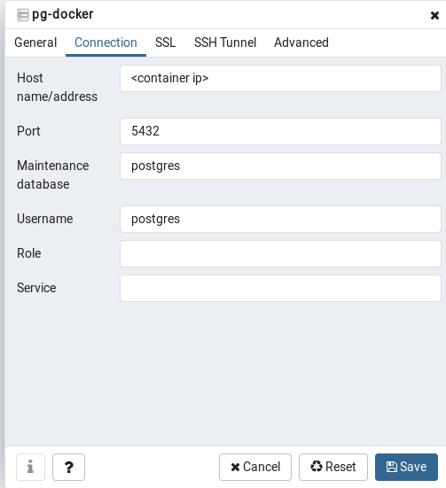

# Docker Installation Instructions For Ubuntu 19.04
## Commands come from [Grigor Khachatryan's](https://medium.com/@Grigorkh/how-to-install-docker-on-ubuntu-19-04-7ccfeda5935) and [Syed Komail Abbas'](https://hackernoon.com/dont-install-postgres-docker-pull-postgres-bee20e200198) Docker tutorials

### Add GPG Key For Official Docker Repo 
`curl -fsSL https://download.docker.com/linux/ubuntu/gpg | sudo apt-key add -`

### Add Repo To System (Stable only repo doesn't exist yet for 19.04)
`sudo add-apt-repository "deb [arch=amd64] https://download.docker.com/linux/ubuntu $(lsb_release -cs) stable edge test"`

### Ensure Installing From Docker Repo And Not Ubuntu Default Repo
`apt-cache policy docker-ce`

Output: 
```
docker-ce:
  Installed: (none)
  Candidate: 5:19.03.0~1.5.beta5-0~ubuntu-disco
  Version table:
 *** 5:19.03.0~1.5.beta5-0~ubuntu-disco 500
        500 https://download.docker.com/linux/ubuntu disco/test amd64 Packages
        100 /var/lib/dpkg/status
     5:19.03.0~1.4.beta4-0~ubuntu-disco 500
        500 https://download.docker.com/linux/ubuntu disco/test amd64 Packages
     5:19.03.0~1.3.beta3-0~ubuntu-disco 500
        500 https://download.docker.com/linux/ubuntu disco/test amd64 Packages
     5:19.03.0~1.2.beta2-0~ubuntu-disco 500
        500 https://download.docker.com/linux/ubuntu disco/test amd64 Packages
     5:19.03.0~1.1.beta1-0~ubuntu-disco 500
        500 https://download.docker.com/linux/ubuntu disco/test amd64 Packages
```

### Check Docker Staus And Make Sure Is Running
`sudo systemctl status docker`

Output: 
```
● docker.service - Docker Application Container Engine
   Loaded: loaded (/lib/systemd/system/docker.service; enabled; vendor preset: 
   Active: active (running) since Fri 2019-05-31 17:43:31 PDT; 11min ago
     Docs: https://docs.docker.com
 Main PID: 8324 (dockerd)
    Tasks: 12
   Memory: 40.3M
   CGroup: /system.slice/docker.service
           └─8324 /usr/bin/dockerd -H fd:// --containerd=/run/containerd/contai

May 31 17:43:31 <youruser> dockerd[8324]: time="2019-05-31T17:43:31.366671980-07:00
May 31 17:43:31 <youruser> dockerd[8324]: time="2019-05-31T17:43:31.366682440-07:00
May 31 17:43:31 <youruser> dockerd[8324]: time="2019-05-31T17:43:31.367023487-07:00
May 31 17:43:31 <youruser> dockerd[8324]: time="2019-05-31T17:43:31.368620032-07:00
May 31 17:43:31 <youruser> dockerd[8324]: time="2019-05-31T17:43:31.529253221-07:00
May 31 17:43:31 <youruser> dockerd[8324]: time="2019-05-31T17:43:31.655852930-07:00
May 31 17:43:31 <youruser> dockerd[8324]: time="2019-05-31T17:43:31.797542770-07:00
May 31 17:43:31 <youruser> dockerd[8324]: time="2019-05-31T17:43:31.797631727-07:00
May 31 17:43:31 <youruser> systemd[1]: Started Docker Application Container Engine.
May 31 17:43:31 <youruser> dockerd[8324]: time="2019-05-31T17:43:31.821129140-07:00
```

### Install Docker Community Edition
`sudo apt-get install -y docker-ce`

### Add User To Docker Group To Avoid Having To Use `sudo` Each Time With Docker
`sudo usermod -aG docker ${USER}`

### Confirm User Is Part Of Docker Group
`id -nG`

Output:   
`<youruser> adm sudo docker`

### Pull Down [MDillon's](https://hub.docker.com/r/mdillon/postgis/) Postgres/PostGIS Docker Image
`docker pull mdillon/postgis`

### Create Data Dir For Container So Data Is Persistent (Othewise Data Is Lost Once Container Is Shutdown)
`mkdir -p $HOME/docker/volumes/postgres`

### Startup The New Docker Container
`docker run --rm --name pg-docker -e POSTGRES_PASSWORD=<password> -d -p 5433:5432 -v $HOME/docker/volumes/postgres:/var/lib/postgresql/data`

Flags:  
`--rm`  Removes the container and its file system once container has been shutdown. It's generally regarded as good practice to pass this flag and if data needs to be persisten the `--v` flag can be passed.  
`--name`  Name you would like for the container to identify it.    
`--e`  Expose the `POSTGRES_PASSWORD` varible so we can set a a password for the DB.   
`-d`  Launch the container in the background.    
`-p` Bind port on local host to port in container.  So in this instacne port 5433 on local host is bound to 5432 of the container.  Port 5432 was already being used by my local instance of Postgres.  
`-v` Mount the newly created `$HOME/docker/volumes/postgres` dir to the /`var/lib/postgresql/data` dir of the container so the data is persistent.  

### Determine IP of Container To Connect With PGADMIN4
`docker inspect -f '{{range .NetworkSettings.Networks}}{{.IPAddress}}{{end}}' pg-docker`

   


# PostGIS Analysis For SLEV/WNV Positives In Vulnerable Census Tracts

#### Add CDC 2016 GeoJSON to PostGIS

`ogr2ogr -f "PostgreSQL" PG:"host=<container ip> dbname=california user=postgres password=123" cdcSVI2016.geojson -nln data.cdc_svi_2016`


#### Add SLEV GeoJSON to PostGIS

`ogr2ogr -f "PostgreSQL" PG:"host=<container ip> dbname=california user=postgres password=123" sle2015_2018_cleaned.geojson -nln data.sle_2015_2018`


#### Change date column in SLEV table to date type from string

```sql
ALTER TABLE data.sle_2015_2018
ALTER COLUMN date TYPE date using to_date(date, 'MM/DD/YYYY');
```

#### Change date field unix timestamps

```
extract(EPOCH from data.sle_2015_2018.date) as date_timestamp
```

#### Reproject point geometry in SLEV table to  CA Albers

```sql
alter table data.sle_2015_2018
alter column wkb_geometry
type geometry(Point, 3310)
using st_transform(wkb_geometry, 3310);
```


#### Reproject polygon/multipolygon geometry in CDC 2016 table to CA Albers

```sql
alter table data.cdc_svi_2016
alter column wkb_geometry
type geometry(Geometry, 3310)
using st_transform(wkb_geometry, 3310);
```

#### Rename tables to reflect geometry projection

```sql
ALTER TABLE data.cdc_svi_2016
RENAME TO cdc_svi_2016_3310;
```

```sql
ALTER TABLE data.sle2015_2018
RENAME TO sle_2015_2018_3310;
```


#### Points within CDC SVI polygons with overall vulnerability value of >= .75 

```sql
 SELECT year_2016.city,
    year_2016.county,
    year_2016.spectype,
    year_2016.wkb_geometry
   FROM ( SELECT sle_2015_2018_3310.ogc_fid,
            sle_2015_2018_3310.date,
            sle_2015_2018_3310.city,
            sle_2015_2018_3310.county,
            sle_2015_2018_3310.virus,
            sle_2015_2018_3310.spectype,
            sle_2015_2018_3310.wkb_geometry
           FROM data.sle_2015_2018_3310
          WHERE date_part('year'::text, sle_2015_2018_3310.date) = '2016'::double precision) year_2016
     JOIN data.cdc_svi_2016_3310 ON st_dwithin(year_2016.wkb_geometry, cdc_svi_2016_3310.wkb_geometry, 0::double precision)
  WHERE cdc_svi_2016_3310.rpl_themes >= 0.75::double precision;
```

#### Export the above view to a GeoJSON with GDAL

`ogr2ogr -t_srs EPSG:4326 -s_srs EPSG:3310 -f GeoJSON sle_2016_cdc_svi_gt75.geojson "PG:host=<container ip> dbname=california user=postgres password=123" -sql "SELECT * FROM data.sle_2016_cdc_svi"`

#### Working with the WNV data was similar to the SLEV commands above with one exception.
#### Since the date column was a list of strings (e.g. `8-19-2003, 9-2-2003`) a new `date_array` column was created to work with instead of manipulating the original column.
```sql
-- Add a data_array column to hold a copy of the date column to manipulate as an array type
ALTER TABLE data.wnv_2003_2018_3310
ADD COLUMN date_array varchar;

-- Copy over date to date_array
UPDATE data.wnv_2003_2018_3310 
SET date_array = date;

-- Change tpe of the date_array column
alter table data.wnv_2003_2018_3310 alter date_array drop default;
alter table data.wnv_2003_2018_3310 alter date_array type text[] using array [date];
alter table data.wnv_2003_2018_3310 alter date_array set default '{}';
```

#### Table was then queried similar to the SLEV table to get WNV points in vulnerable census tracts for a given year.
#### The `where` clause in the subquery was changed to be able to access the first element of the entry in the `date_array` column to pick out a particular year. 
```sql
  SELECT year_2010.city,
    year_2010.spectype,
    year_2010.wkb_geometry
   FROM ( SELECT wnv_2003_2018_3310.ogc_fid,
            wnv_2003_2018_3310.date,
            wnv_2003_2018_3310.city,
            wnv_2003_2018_3310.virus,
            wnv_2003_2018_3310.spectype,
            wnv_2003_2018_3310.wkb_geometry
           FROM data.wnv_2003_2018_3310
          WHERE wnv_2003_2018_3310.date_array[1] ~~ '%2010%'::text) year_2010
     JOIN data.cdc_svi_2010_3310 ON st_dwithin(year_2010.wkb_geometry, cdc_svi_2010_3310.wkb_geometry, 0::double precision)
  WHERE cdc_svi_2010_3310.r_pl_theme >= 0.75::double precision;
```

#### Counts of detections by city for 2016 from SLEV table

```sql
 SELECT count(*) AS thecount,
    city_counts.city,
    city_counts.spectype,
    city_counts.county
   FROM ( SELECT sle_2015_2018_3310.ogc_fid,
            sle_2015_2018_3310.date,
            sle_2015_2018_3310.city,
            sle_2015_2018_3310.county,
            sle_2015_2018_3310.virus,
            sle_2015_2018_3310.spectype,
            sle_2015_2018_3310.wkb_geometry
           FROM data.sle_2015_2018_3310
          WHERE date_part('year'::text, sle_2015_2018_3310.date) = '2016'::double precision) city_counts
  GROUP BY city_counts.city, city_counts.county, city_counts.spectype
  ORDER BY (count(*)) DESC;
```

